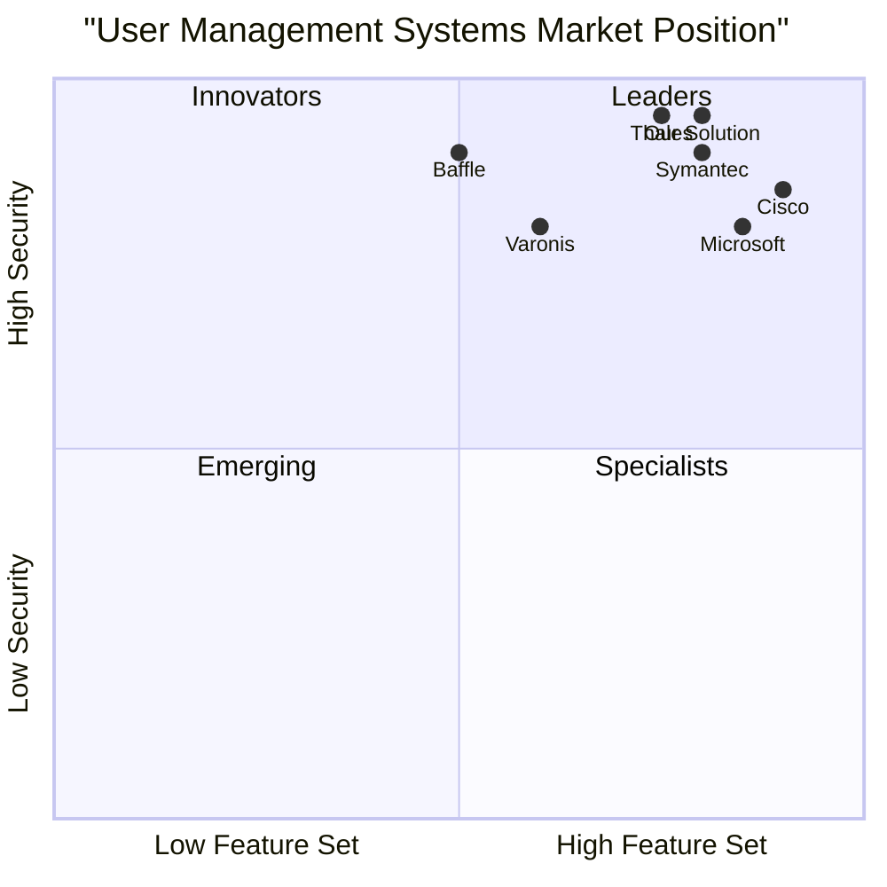
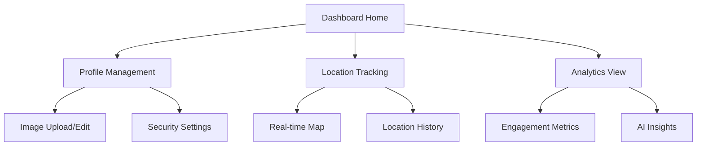

# Product Requirements Document (PRD)
Advanced Real-Time User Management System with Encrypted Images & AI-Driven Analytics

## Document Information
- Version: 1.0
- Last Updated: 2025-03-15
- Status: Draft

## 1. Introduction

### 1.1 Project Overview
The Advanced Real-Time User Management System is a comprehensive platform that combines real-time user tracking, secure image management, and AI-driven analytics. This system aims to provide organizations with a secure, scalable, and intelligent solution for managing user data and interactions.

### 1.2 Problem Statement
Organizations face increasing challenges in:
- Tracking and managing user locations in real-time while maintaining privacy
- Securely storing and managing user profile images
- Gathering and analyzing user engagement data effectively
- Meeting compliance requirements for data protection

### 1.3 Product Vision
To become the industry-leading user management platform that sets new standards in security, real-time capabilities, and AI-driven insights while maintaining user privacy and data protection.

## 2. Market Analysis

### 2.1 Market Overview
The real-time user management system market intersects with several growing segments:
- Global AI in Customer Experience Market: USD 10.5B (2023) → USD 76.7B (2033), CAGR 22.0%
- Customer Engagement Solutions: USD 21.4B (2024) → USD 69.8B (2032), CAGR 15.9%
- Encrypted Data Management: USD 2.8B (2022) → USD 8.3B (2030), CAGR 14.8%

### 2.2 Market Trends
1. Cloud-First Solutions
   - Increased adoption of cloud-hosted platforms
   - Enhanced scalability and flexibility
   - Improved cross-location management

2. Advanced Security Features
   - GDPR and CCPA compliance focus
   - Biometric authentication integration
   - Zero-trust security models

3. AI and Analytics
   - 54% of companies report improved efficiency with AI
   - AI expected to power 95% of customer interactions by 2025
   - Real-time analytics for decision-making

### 2.3 Competitive Analysis

## 3. User Stories and Requirements

### 3.1 User Personas

1. System Administrator
   - As a system administrator, I want to monitor user locations in real-time
   - As a system administrator, I want to manage encryption keys and security settings
   - As a system administrator, I want to view comprehensive analytics dashboards

2. End User
   - As an end user, I want to update my profile and image securely
   - As an end user, I want to control my location sharing preferences
   - As an end user, I want to access my data across different devices

3. Security Officer
   - As a security officer, I want to monitor system access patterns
   - As a security officer, I want to receive real-time security alerts
   - As a security officer, I want to audit user activities and data access

### 3.2 Requirements Pool

#### P0 (Must Have)
1. Real-time Location Tracking
   - WebSocket-based location updates
   - Configurable update frequency
   - Location history storage

2. Secure Image Management
   - AES-256 encryption for profile images
   - Secure key management
   - Local storage optimization

3. Basic Analytics
   - User engagement metrics
   - Profile view tracking
   - Basic trend analysis

#### P1 (Should Have)
1. Advanced Analytics
   - AI-powered behavior prediction
   - Custom dashboard creation
   - Trend visualization

2. Enhanced Security
   - Multi-factor authentication
   - Automated threat detection
   - Advanced audit logging

#### P2 (Nice to Have)
1. Additional Features
   - Face recognition integration
   - Cross-device synchronization
   - OpenAI integration for insights

## 4. Technical Architecture

### 4.1 System Components

1. Frontend Layer
   - React.js-based Single Page Application
   - WebSocket client for real-time updates
   - Local storage encryption module
   - TensorFlow.js for client-side AI processing

2. Backend Layer
   - Node.js with Express.js/Nest.js
   - WebSocket server (Socket.io)
   - RESTful API endpoints
   - Authentication & Authorization service

3. Database Layer
   - PostgreSQL for relational data
   - Redis for caching and real-time data
   - MongoDB for analytics data

4. AI/Analytics Layer
   - TensorFlow-based analytics engine
   - Real-time data processing pipeline
   - Predictive modeling service

### 4.2 Security Architecture

1. Data Encryption
   - AES-256 for image encryption
   - End-to-end encryption for sensitive data
   - Secure key management system

2. Authentication & Authorization
   - JWT-based authentication
   - Role-based access control (RBAC)
   - OAuth2.0 integration

3. Network Security
   - SSL/TLS encryption
   - WebSocket security protocols
   - API request rate limiting

## 5. UI/UX Specifications

### 5.1 User Dashboard

### 5.2 Key Interface Requirements

1. Dashboard
   - Clean, minimalist design
   - Real-time updates without page refresh
   - Responsive layout for all devices
   - Dark/light theme support

2. Profile Management
   - Drag-and-drop image upload
   - In-place editing capabilities
   - Preview of encrypted storage status

3. Analytics Interface
   - Interactive charts and graphs
   - Customizable date ranges
   - Export functionality
   - Real-time data updates

## 6. Implementation Timeline

### 6.1 Phase 1 (Months 1-2)
- Basic user management system
- Core authentication
- Profile management

### 6.2 Phase 2 (Months 3-4)
- Real-time location tracking
- Image encryption system
- WebSocket implementation

### 6.3 Phase 3 (Months 5-6)
- AI analytics integration
- Advanced security features
- Performance optimization

## 7. Success Metrics

### 7.1 Performance KPIs
- Page load time < 2 seconds
- Real-time updates < 100ms latency
- 99.9% system uptime
- < 1 second image encryption/decryption

### 7.2 Business KPIs
- 95% user adoption rate
- 30% reduction in data management overhead
- 50% improvement in user engagement tracking accuracy
- 40% faster security incident response

## 8. Open Questions

1. Technical Considerations
   - Optimal WebSocket connection management for large user bases
   - AI model update strategy
   - Cross-platform encryption key management

2. Business Considerations
   - Data retention policies
   - Compliance requirements for different regions
   - Pricing strategy for different tiers

## 9. Appendix

### 9.1 Technical Stack
- Frontend: React.js, TailwindCSS, Socket.io-client
- Backend: Node.js, Express.js, Socket.io
- Database: PostgreSQL, Redis, MongoDB
- AI/ML: TensorFlow.js, Python ML services

### 9.2 Security Standards
- GDPR compliance
- CCPA compliance
- SOC 2 Type II certification
- ISO 27001 compliance

---
End of PRD
